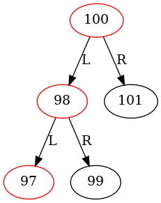
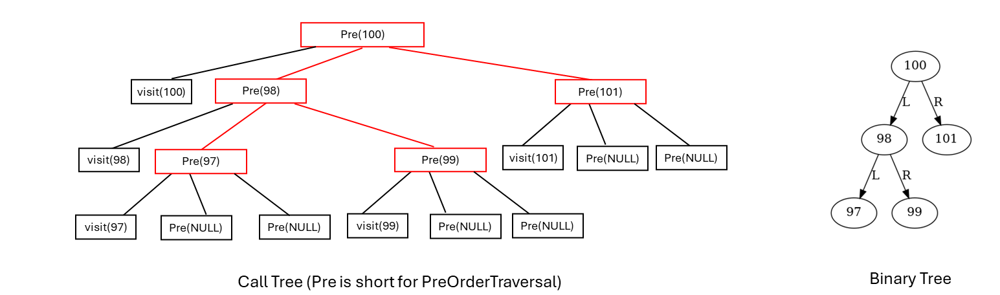
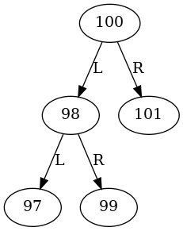
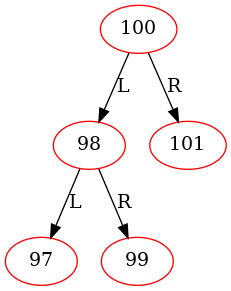
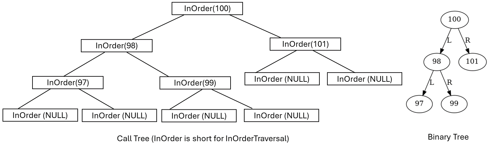
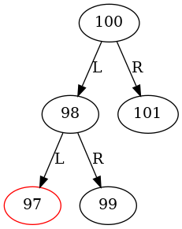
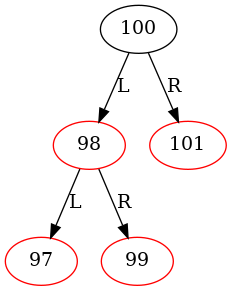
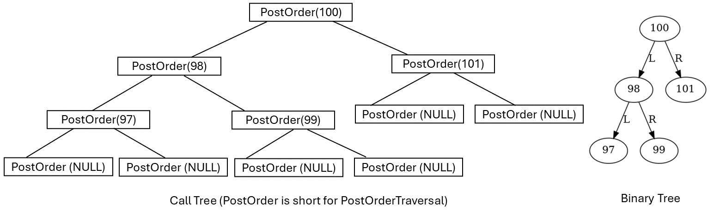
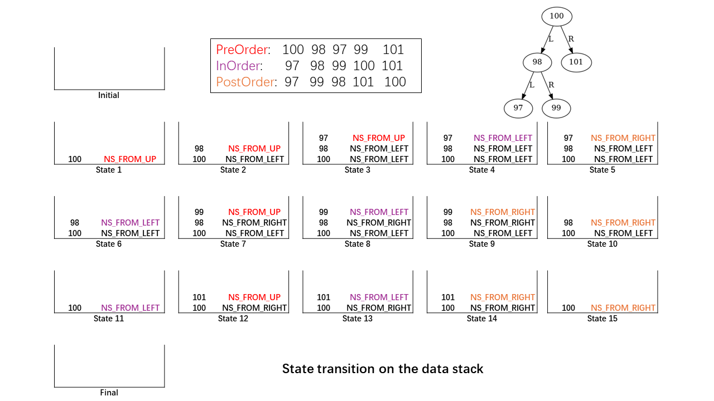

# Tree Traversal

``` sh
/*******************************************************************
                    Tree Traversal

    1.  Pre-order traversal

    2.  In-order traversal

    3.  Post-order traversal

                                             COMP9024 24T2

 *******************************************************************/
``` 

We have discussed how to create a *.dot file in [COMP9024/Trees/Tree2Dot](../../Trees/Tree2Dot/README.md) for a binary tree.

There are three ways to traverse a binary tree in depth-first order: **in-order**, **pre-order** and **post-order**.

First, we will study how to perform a recursive DFS traversal on a binary tree.

Based on the data stack introduced in [COMP9024/Stacks/Stack_LL](../../Stacks/Stack_LL/README.md), we will also discuss non-recursive algorithms for performing pre-order and post-order traversals of trees, with a focus on tracking the state of each tree node.

Non-recursive in-order traversal is left as the weekly practical exercise in [Tutorial 6](../../Tutorials/Week8/README.md).


### In-Order Traversal

(1) The left subtree is traversed.

(2) The root node is traversed.

(3) The right subtree is traversed.

```C
/*

Input:
           100
          /   \
        98    101
       /  \
     97    99

Output:

     97  98  99 100 101
 */

// An example in this project (COMP9024/Trees/TreeTraversal)
void InOrderTraversal(BiTreeNodePtr root, NodeVisitor visit) {
    if (root) {
        InOrderTraversal(root->leftChild, visit);
        visit(root);
        InOrderTraversal(root->rightChild, visit);
    }
}
```

### Pre-Order Traversal

(1) The root node is traversed.

(2) The left subtree is traversed.

(3) The right subtree is traversed.

```C
// An example in COMP9024/Trees/Tree2Dot
static void DisplayVisited(FILE *dotFile, BiTreeNodePtr root) {
    if (root) {
        if (root->visited) {
            fprintf(dotFile, "\"%s\" [color=red]\n", root->value.name);
        }
        DisplayVisited(dotFile, root->leftChild);
        DisplayVisited(dotFile, root->rightChild);
    }
}
```

### Post-Order Traversal

(1) The left subtree is traversed.

(2) The right subtree is traversed.

(3) The root node is traversed.

```C
// An example in COMP9024/Trees/Tree2Dot
void ReleaseBinaryTree(BiTreeNodePtr root) {
    if (root) {
        ReleaseBinaryTree(root->leftChild);
        ReleaseBinaryTree(root->rightChild);
        free(root);
    }
}
```


## 1 How to download this project in [CSE VLAB](https://vlabgateway.cse.unsw.edu.au/)

Open a terminal (Applications -> Terminal Emulator)

```sh

$ git clone https://github.com/sheisc/COMP9024.git

$ cd COMP9024/Trees/TreeTraversal

TreeTraversal$ 

```


## 2 How to start [Visual Studio Code](https://code.visualstudio.com/) to browse/edit/debug a project.


```sh

TreeTraversal$ code

```

Two configuration files (TreeTraversal/.vscode/[launch.json](https://code.visualstudio.com/docs/cpp/launch-json-reference) and TreeTraversal/.vscode/[tasks.json](https://code.visualstudio.com/docs/editor/tasks)) have been preset.


#### 2.1 Open the project in VS Code

In the window of Visual Studio Code, please click "File" and "Open Folder",

select the folder "COMP9024/Trees/TreeTraversal", then click the "Open" button.


#### 2.2 Build the project in VS Code

click **Terminal -> Run Build Task**


#### 2.3 Debug the project in VS Code

Open src/main.c, and click to add a breakpoint (say, line 8).

Then, click **Run -> Start Debugging**

### 2.4 Directory

```sh
├── Makefile             defining set of tasks to be executed (the input file of the 'make' command)
|
├── README.md            introduction to this tutorial
|
├── src                  containing *.c and *.h
|   |
│   ├── Stack.c          for non-recursive tree traversal
│   ├── Stack.h
|   |
│   ├── BiTree.c         binary tree and its traversal
│   ├── BiTree.h
|   |
│   ├── Queue.c          used in a breadth-first tree traversal when generating *.dot files
│   ├── Queue.h
|   |
│   └── main.c           main()
|
|── images               containing *.dot and *.png files
|
|── diagrams             containing image files
|
└── .vscode              containing configuration files for Visual Studio Code
    |
    ├── launch.json      specifying which program to debug and with which debugger,
    |                    used when you click "Run -> Start Debugging"
    |
    └── tasks.json       specifying which task to run (e.g., 'make' or 'make clean')
                         used when you click "Terminal -> Run Build Task" or "Terminal -> Run Task"
```

Makefile is discussed in [COMP9024/C/HowToMake](../../C/HowToMake/README.md).

## 3 The main procedure

### 3.1 make and ./main

**In addition to utilizing VS Code, we can also compile and execute programs directly from the command line interface as follows.**
```sh

         100
        /   \
      98    101
     /  \
   97    99 

```

``` sh

TreeTraversal$ make

TreeTraversal$ ./main

*****************  PreOrderTraversal() **********************
Visiting 100
Visiting 98
Visiting 97
Visiting 99
Visiting 101


*****************  InOrderTraversal() **********************
Visiting 97
Visiting 98
Visiting 99
Visiting 100
Visiting 101


*****************  PostOrderTraversal() **********************
Visiting 97
Visiting 99
Visiting 98
Visiting 101
Visiting 100

*****************  PreOrderTraversal2() **********************
Visiting 100
Visiting 98
Visiting 97
Visiting 99
Visiting 101

*****************  PostOrderTraversal2() **********************
Visiting 97
Visiting 99
Visiting 98
Visiting 101
Visiting 100


```

### 3.2 make view

**Ensure that you have executed 'make' and './main' before 'make view'.**


```sh
TreeTraversal$ make view
```

**Click on the window of 'feh' or use your mouse scroll wheel to view images**.

Here, **feh** is an image viewer available in [CSE VLAB](https://vlabgateway.cse.unsw.edu.au/).

### When debugging this program in VS Code, you can set a breakpoint at line 8 in [src/main.c](./src/main.c) to observe the nodes on call stack.

#### 3.2.1 Pre-order traversal

| Initial | Visiting 100  |  Visiting 98  |
|:-------------:|:-------------:|:-------------:|
| | Nodes on call stack: $\color{red}{100}$ | Nodes on call stack: $\color{red}{98}$, 100|
|  |   |  |


| Visiting 97 | Visiting 99  |  Visiting 101  |
|:-------------:|:-------------:|:-------------:|
|Nodes on call stack: $\color{red}{97}$, 98, 100| Nodes on call stack: $\color{red}{99}$, 98, 100 | Nodes on call stack: $\color{red}{101}$, 100|
|  |   |  |

| Call Tree and Binary Tree | 
|:-------------:|
|  | 

#### 3.2.2 In-order traversal

| Initial | Visiting 97  |  Visiting 98  |
|:-------------:|:-------------:|:-------------:|
| | Nodes on call stack: $\color{red}{97}$, 98, 100 | Nodes on call stack: $\color{red}{98}$, 100|
|  |   |  |


| Visiting 99 | Visiting 100  |  Visiting 101  |
|:-------------:|:-------------:|:-------------:|
| Nodes on call stack: $\color{red}{99}$, 98, 100| Nodes on call stack: $\color{red}{100}$|Nodes on call stack: $\color{red}{101}$, 100|
|  |   |  |

| Call Tree and Binary Tree | 
|:-------------:|
|  | 

#### 3.2.3 Post-order traversal

| Initial | Visiting 97  |  Visiting 99  |
|:-------------:|:-------------:|:-------------:|
| | Nodes on call stack: $\color{red}{97}$, 98, 100 | Nodes on call stack: $\color{red}{99}$, 98, 100|
|  |   |  |


| Visiting 98 | Visiting 101  |  Visiting 100  |
|:-------------:|:-------------:|:-------------:|
| Nodes on call stack: $\color{red}{98}$, 100| Nodes on call stack: $\color{red}{101}$, 100|Nodes on call stack: $\color{red}{100}$|
|  |   |  |

| Call Tree and Binary Tree | 
|:-------------:|
|  | 

## 4 Data structures

```C
typedef enum {
    NS_FROM_UP,      // 0   
    NS_FROM_LEFT,    // 1
    NS_FROM_RIGHT,   // 2
} NodeState;

struct BiTreeNode {
    /*
     The value of a binary tree node:
  
     1. an integer for representing the node's value (e.g., 300), 
      
     2. a C string for representing its node name
     */
    NodeValue value;  
    // left subtree
    struct BiTreeNode *leftChild;
    // right subtree
    struct BiTreeNode *rightChild;
    // the current state when this node is pushed on the data stack (in non-recursive traversals)
    NodeState state;
    // whether this node has been visited
    int visited;
};

typedef struct BiTreeNode *BiTreeNodePtr;
```


## 5 Algorithms

### 5.1 Recursive Algorithms

```C

typedef void (* NodeVisitor)(BiTreeNodePtr pNode);

void PrintNodeInfo(BiTreeNodePtr pNode) {
    printf("Visiting %s\n", pNode->value.name);
    pNode->visited = 1;
}

void PreOrderTraversal(BiTreeNodePtr root, NodeVisitor visit) {
    if (root) {
        visit(root);
        PreOrderTraversal(root->leftChild, visit);    
        PreOrderTraversal(root->rightChild, visit);
    }
}


void InOrderTraversal(BiTreeNodePtr root, NodeVisitor visit) {
    if (root) {
        InOrderTraversal(root->leftChild, visit);
        visit(root);
        InOrderTraversal(root->rightChild, visit);
    }
}

void PostOrderTraversal(BiTreeNodePtr root, NodeVisitor visit) {
    if (root) {
        PostOrderTraversal(root->leftChild, visit);    
        PostOrderTraversal(root->rightChild, visit);
        visit(root);
    }
}

```

### main()
```C
void ResetNodeState(BiTreeNodePtr root) {
    if (root) {
        ResetNodeState(root->leftChild);
        ResetNodeState(root->rightChild);
        root->visited = 0;
    }
}

void PrintNodeInfo(BiTreeNodePtr pNode) {
    printf("Visiting %s\n", pNode->value.name);
    pNode->visited = 1;
}

int main(int argc, char **argv, char **env) {

    // Create a binary tree
    BiTreeNodePtr root = CreateBinaryTree();

    // create a sub-directory 'images' (if it is not present) in the current directory
    system("mkdir -p images");

    printf("*****************  PreOrderTraversal() **********************\n");
    PreOrderTraversal(root, PrintNodeInfo);
    printf("\n\n");

    printf("*****************  InOrderTraversal() **********************\n");
    InOrderTraversal(root, PrintNodeInfo);
    printf("\n\n");


    printf("*****************  PostOrderTraversal() **********************\n");
    PostOrderTraversal(root, PrintNodeInfo);
    printf("\n\n");

    printf("*****************  PreOrderTraversal2() **********************\n");
    ResetNodeState(root);
    PreOrderTraversal2(root, PrintNodeInfo);
    printf("\n\n");

    printf("*****************  PostOrderTraversal2() **********************\n");
    ResetNodeState(root);
    PostOrderTraversal2(root, PrintNodeInfo);
    printf("\n\n");

    // Free the heap memory
    ReleaseBinaryTree(root);

    return 0;
}

```

### 5.2 Non-Recursive Algorithms


#### 5.2.1 Node States in a non-recursive algorithm
```sh
During the depth-first traversal of a binary tree, 
there are three times we arrive at a binary tree node:

(1) from its parent 
(2) from its left child
(3) from its right child

We can use the following node states to represent different stages
when we walk through a binary tree node in a non-recursive algorithm.
```


```sh
It is a simple finite-state machine, with the following state transition:
 NS_FROM_UP  --->  NS_FROM_LEFT  ---> NS_FROM_RIGHT

For more information about the finite-state machine (Finite Automata, including DFA/NFA), 
please refer to COMP9102 (Programming Languages and Compilers).

For a non-recursive pre-order traversal,
  we need to visit the top node on the stack when it is at state NS_FROM_UP.

For a non-recursive in-order traversal,
  we need to visit the top node on the stack when it is at state NS_FROM_LEFT.

For a non-recursive post-order traversal,
  we need to visit the top node on the stack when it is at state NS_FROM_RIGHT.

```

For more details about Deterministic Finite Automata (DFA) , please see [Programming Languages and Compilers (COMP3131/COMP9102)](https://webcms3.cse.unsw.edu.au/COMP3131/24T1/).

**In this project, the state transition occurs when a binary tree node becomes the top element of the data stack.**

**In the non-recursive DFS algorithm, the data stack mimics/imitates the behavior of the call stack in the recursive algorithm.**

| State Transition |
|:-------------:|
|  |

#### 5.2.2 Non-recursive pre-order traversal
```C
void PreOrderTraversal2(BiTreeNodePtr root, NodeVisitor visit) {
    static long cnt = 0;    

    if (root) {
        struct Stack *pStack = CreateStack();
        root->state = NS_FROM_UP;

        GenOneImage(root, "PreOrderTraversal2", "images/PreOrderTraversal2", cnt);

        StackPush(pStack, root);
        while (!StackIsEmpty(pStack)) {
            BiTreeNodePtr curNode = StackPeek(pStack);
            switch (curNode->state) {
                case NS_FROM_UP:
                    visit(curNode);
                    cnt++;
                    GenOneImage(root, "PreOrderTraversal2", "images/PreOrderTraversal2", cnt);        
                    // When curNode becomes the top node again, it means we have visited its left sub-tree.
                    curNode->state = NS_FROM_LEFT;
                    // Push its left child (if existing)
                    if (curNode->leftChild) {
                        curNode->leftChild->state = NS_FROM_UP;
                        StackPush(pStack, curNode->leftChild);
                    }
                    break;
                case NS_FROM_LEFT:
                    // When curNode becomes the top node again, it means we have visited its right sub-tree.
                    curNode->state = NS_FROM_RIGHT;
                    if (curNode->rightChild) {
                        curNode->rightChild->state = NS_FROM_UP;
                        StackPush(pStack, curNode->rightChild);
                    }
                    break;
                case NS_FROM_RIGHT:
                    // We can pop the node now
                    StackPop(pStack);
                    break;
                default:
                    break;
            }
        }
      ReleaseStack(pStack);
    }
}
```

#### 5.2.3 Non-recursive post-order traversal
```C
void PostOrderTraversal2(BiTreeNodePtr root, NodeVisitor visit) {
    static long cnt = 0;

    if (root) {
        struct Stack *pStack = CreateStack();
        root->state = NS_FROM_UP;

        GenOneImage(root, "PostOrderTraversal2", "images/PostOrderTraversal2", cnt);

        StackPush(pStack, root);
        while (!StackIsEmpty(pStack)) {
            BiTreeNodePtr curNode = StackPeek(pStack);
            switch (curNode->state) {
                case NS_FROM_UP:
                    // when curNode becomes the top node again, it means we have visited its left sub-tree.          
                    curNode->state = NS_FROM_LEFT;
                    // Push its left child (if existing)
                    if (curNode->leftChild) {
                        curNode->leftChild->state = NS_FROM_UP;
                        StackPush(pStack, curNode->leftChild);
                    }
                    break;
                case NS_FROM_LEFT:
                    // when curNode becomes the top node again, it means we have visited its right sub-tree.
                    curNode->state = NS_FROM_RIGHT;
                    // Push its right child (if existing)
                    if (curNode->rightChild) {
                        curNode->rightChild->state = NS_FROM_UP;
                        StackPush(pStack, curNode->rightChild);
                    }
                    break;
                case NS_FROM_RIGHT:
                    visit(curNode);
                    cnt++;
                    GenOneImage(root, "PostOrderTraversal2", "images/PostOrderTraversal2", cnt);
                    // We can pop the node now
                    StackPop(pStack);
                    break;
                default:
                    break;
            }
        }
        ReleaseStack(pStack);
    }
}
```
