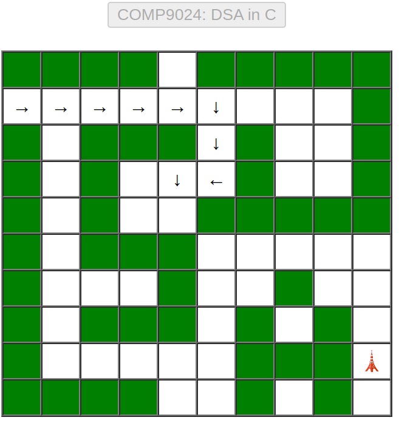

# Maze

``` sh
/*******************************************************************
                    Tutorial 8    Maze

    1.  How to explore a maze with a non-randomised algorithm

    2.  How to explore a maze with a randomised algorithm 
        (flip a coin or roll a dice)

                                             COMP9024 24T2

 *******************************************************************/
``` 

Exploring a maze using a [data stack](../../Stacks/Stack_LL/README.md) is like following a trail of markers: 

it helps you backtrack and navigate through twists and turns efficiently. 

Imagine you're inside a maze, armed with a stack of markers. 

As you move forward, you leave a marker (or push it onto the stack). 

If you reach a dead end, you need to backtrack by popping markers off the stack until you find a new path to explore.

| Initial | 
|:-------------:|
|  |

| Exploring  |
|:-------------:|
|   |

|  Completed  |
|:-------------:|
|  |

This method ensures that every possible path is explored until the exit is found or all available paths are exhausted. 

By leveraging the stack, the algorithm maintains a record of where it has been, guiding the search towards the solution methodically.

An animation in exploring a maze can be found at the following link.

[Animation: Exploring a Maze in JavaScript](https://sheisc.github.io/slides/COMP9024/24T2/week10/maze.html)

In this tutorial, we study how to explore a maze with a non-randomised algorithm.

The randomised algorithm is left as the weekly practical exercise.

## 1 How to download COMP9024/Tutorials/Week10 in [CSE VLAB](https://vlabgateway.cse.unsw.edu.au/)

Open a terminal (Applications -> Terminal Emulator)

```sh

$ git clone https://github.com/sheisc/COMP9024.git

$ cd COMP9024/Tutorials/Week10

Week10$ 

```


## 2 How to start [Visual Studio Code](https://code.visualstudio.com/) to browse/edit/debug a project.

```sh

Week10$ code

```

Two configuration files (Week10/.vscode/[launch.json](https://code.visualstudio.com/docs/cpp/launch-json-reference) and Week10/.vscode/[tasks.json](https://code.visualstudio.com/docs/editor/tasks)) have been preset.


#### 2.1 Open the project in VS Code

In the window of Visual Studio Code, please click "File" and "Open Folder",

select the folder "COMP9024/Tutorials/Week10", then click the "Open" button.


#### 2.2 Build the project in VS Code

click **Terminal -> Run Build Task**


#### 2.3 Debug the project in VS Code

Open src/Maze.c, and click to add a breakpoint (say, line 165).

Then, click **Run -> Start Debugging**

### 2.4 Directory

```sh
├── Makefile             defining set of tasks to be executed (the input file of the 'make' command)
|
├── README.md            introduction to this tutorial
|
├── src                  containing *.c and *.h
|   |
│   ├── Maze.c           explore a maze
│   ├── Maze.h
|   |
│   ├── Stack.c          For recording the trail in exploring a maze
│   ├── Stack.h
|   |
│   └── main.c           main()
|
|── images
|
└── .vscode              containing configuration files for Visual Studio Code
    |
    ├── launch.json      specifying which program to debug and with which debugger,
    |                    used when you click "Run -> Start Debugging"
    |
    └── tasks.json       specifying which task to run (e.g., 'make' or 'make clean')
                         used when you click "Terminal -> Run Build Task" or "Terminal -> Run Task"
```

Makefile is discussed in [COMP9024/C/HowToMake](../../C/HowToMake/README.md).


## 3 The main procedure

### 3.1 How to see more lines in the terminal in [CSE VLAB](https://vlabgateway.cse.unsw.edu.au/)

Open a terminal (Applications -> Terminal Emulator -> Edit -> Preferences -> Display -> Scrollback lines)


### 3.2 Build and run the program from the command line interface


``` sh

Week10$ make

Week10$ ./main
-------------------------  Step 0 ----------------------------
X   X   X   X       X   X   X   X   X   

                                    X   

X       X   X   X       X           X   

X       X               X           X   

X       X           X   X   X   X   X   

X       X   X   X                       

X               X           X           

X       X   X   X       X       X       

X                       X   X   X   🗼   

X   X   X   X           X       X       
---------------------------------------------------------------


-------------------------  Step 1 ----------------------------
X   X   X   X       X   X   X   X   X   

→                                   X   

X       X   X   X       X           X   

X       X               X           X   

X       X           X   X   X   X   X   

X       X   X   X                       

X               X           X           

X       X   X   X       X       X       

X                       X   X   X   🗼   

X   X   X   X           X       X       
---------------------------------------------------------------


...


-------------------------  Step 152 ----------------------------
X   X   X   X       X   X   X   X   X   

→   ↓                               X   

X   ↓   X   X   X       X           X   

X   ↓   X               X           X   

X   ↓   X           X   X   X   X   X   

X   ↓   X   X   X       →   →   →   ↓   

X   ↓           X   →   ↑   X       ↓   

X   ↓   X   X   X   ↑   X       X   ↓   

X   →   →   →   →   ↑   X   X   X   🗼   

X   X   X   X           X       X       
---------------------------------------------------------------


```

## 4 Data structures

```C

#define ROWS  10
#define COLS  10

// The state of a position in the maze:
//      NOT_VISITED -> TO_RIGHT -> TO_DOWN -> TO_LEFT -> TO_UP -> FINISHED
typedef enum {
    // This position has not been visited yet
    NOT_VISITED = 0,
    // go to visit the adjacent rightward position
    TO_RIGHT = 1,
    // go to visit the adjacent downward position
    TO_DOWN = 2,
    // go to visit the adjacent leftward position
    TO_LEFT = 4,
    // go to visit the adjacent upward position
    TO_UP = 8,
    // We have explored all four directions of the current position, 
    FINISHED = 0x0F,

} PositionState;

// The information about a position in the maze
struct PositionInfo {
    // blocked:  1
    // not blocked: 0, 
    int blocked;

    /////////// used when exploring the maze ///////
    // which row
    int r;
    // which col
    int c;
    // the state of the current position
    PositionState state;
    // points to a unicode string, e.g., upArrowUnicodeStr
    char *dirStr;
};

static int map[ROWS][COLS] = {
    {1, 1, 1, 1, 0, 1, 1, 1, 1, 1}, 
    {0, 0, 0, 0, 0, 0, 0, 0, 0, 1}, 
    {1, 0, 1, 1, 1, 0, 1, 0, 0, 1}, 
    {1, 0, 1, 0, 0, 0, 1, 0, 0, 1}, 
    {1, 0, 1, 0, 0, 1, 1, 1, 1, 1},
    {1, 0, 1, 1, 1, 0, 0, 0, 0, 0},
    {1, 0, 0, 0, 1, 0, 0, 1, 0, 0},
    {1, 0, 1, 1, 1, 0, 1, 0, 1, 0},
    {1, 0, 0, 0, 0, 0, 1, 1, 1, 0},
    {1, 1, 1, 1, 0, 0, 1, 0, 1, 0},
};

static struct PositionInfo maze[ROWS][COLS];

static struct PositionInfo *pStartPos = &maze[1][0];

```

## 5 Algorithms

## 5.1 Overview

```C
int main(int argc, char **argv, char **env) {
    srandom(time(NULL));

    ExploreMaze();
    
    ExploreMazeRandomly();

    return 0;
}
```


#### 5.2 Position States
```sh
We can use the following position states to represent different stages
when we are at a position (row, column) in the maze.

It is a simple finite-state machine, with the following state transition:

 TO_RIGHT -> TO_DOWN -> TO_LEFT -> TO_UP -> FINISHED
```


**For more details about Deterministic Finite Automata (DFA) , please see [Programming Languages and Compilers (COMP3131/COMP9102)](https://webcms3.cse.unsw.edu.au/COMP3131/24T1/).**

## 5.3 ExploreMaze()

```C
static int IsLegalPosition(int r, int c) {
    return (r >= 0) && (r < ROWS) && (c >= 0) && (c < COLS);
}

static int IsExitPosition(int r, int c) {
    if (IsLegalPosition(r, c)) {
        return (r == ROWS - 2) && (c == COLS - 1);
    } else {
        return 0;
    }    
}

/*
    If (r, c) is a legal position, it is not blocked and it has not been explored yet,
    then
        push its position information onto the data stack
 */
static void PushAdjacentPosition(struct Stack *pStack, int r, int c, PositionState initState) {
    if (IsLegalPosition(r, c)) {
        if (!maze[r][c].blocked && (maze[r][c].state == NOT_VISITED)) {
            struct PositionInfo *pPos = &maze[r][c];
            pPos->state = initState;
            StackPush(pStack, pPos);
        }
    }
}

/*
  State transition:

       TO_RIGHT -> TO_DOWN -> TO_LEFT -> TO_UP -> FINISHED
 */
void ExploreMaze(void) {    
    struct Stack *pStack = CreateStack();    
    // Initialize the maze
    InitMaze();
    char *stepName = "Step";
    PrintMaze(stepName);
    // Push the start position
    pStartPos->state = TO_RIGHT;
    StackPush(pStack, pStartPos);

    while (!StackIsEmpty(pStack)) {
        struct PositionInfo *pCurPos = StackPeek(pStack);        
        if (IsExitPosition(pCurPos->r, pCurPos->c)) {
            break;
        }        
        switch(pCurPos->state) {
            case TO_RIGHT:
                pCurPos->dirStr = rightArrowUnicodeStr;              
                PushAdjacentPosition(pStack, pCurPos->r, pCurPos->c + 1, TO_RIGHT);
                // When this position becomes the top element on the stack,  
                // we need to go downward.
                pCurPos->state = TO_DOWN;
                break;
            case TO_DOWN:                
                pCurPos->dirStr = downArrowUnicodeStr;
                PushAdjacentPosition(pStack, pCurPos->r + 1, pCurPos->c, TO_RIGHT);
                // When this position becomes the top element on the stack,  
                // we need to go leftward.                
                pCurPos->state = TO_LEFT;
                break;
            case TO_LEFT:
                pCurPos->dirStr = leftArrowUnicodeStr;                
                PushAdjacentPosition(pStack, pCurPos->r, pCurPos->c - 1, TO_RIGHT);                
                // When this position becomes the top element on the stack,  
                // we need to go upward.                 
                pCurPos->state = TO_UP;
                break;
            case TO_UP:
                pCurPos->dirStr = upArrowUnicodeStr;
                PushAdjacentPosition(pStack, pCurPos->r - 1, pCurPos->c, TO_RIGHT);
                // When this position becomes the top element on the stack,  
                // we have finished all directions.                  
                pCurPos->state = FINISHED;
                break;
            case FINISHED:
                pCurPos->dirStr = NULL;
                StackPop(pStack);                
                break;
            default:
                break;                                
        }
        PrintMaze(stepName);
    }

    ReleaseStack(pStack);
    PrintMaze(stepName);
}
```


## 6 Practical exercise

**Our tutors will NOT answer the following questions in tutorials.**

**Please complete the code in Q1-Q5 (ExploreMazeRandomly() in [Maze.c](./src/Maze.c)) and then answer the questions in Quiz 8 (Week 10) on [Moodle](https://moodle.telt.unsw.edu.au/my/courses.php).**

```C
/*
    This function returns the next unexplored state randomly and also updates pCurPos->state.
 */
static PositionState NextUnexploredState(struct PositionInfo *pCurPos) {
    long x;
    long state = (long) (pCurPos->state);
    assert(pCurPos->state != FINISHED);
    // randomly generate an integer x in {0, 1, 2, 3},
    // such that (1 << x) represents a state which has not been explored yet.
    do {
        x = random();
        x %= 4;
    } while (((1 << x) & state) != 0);

    PositionState nextState = (PositionState)(1 << x);
    pCurPos->state |= nextState;
    return nextState;
}


void ExploreMazeRandomly(void) {
    struct Stack *pStack = CreateStack();
    // Initialize the maze
    InitMaze();
    char *stepName = "Random Step";
    PrintMaze(stepName);

    // pStartPos->state = NOT_VISITED;
    StackPush(pStack, pStartPos);

    while (!StackIsEmpty(pStack)) {
        struct PositionInfo *pCurPos = StackPeek(pStack);
        if (IsExitPosition(pCurPos->r, pCurPos->c)) {
            break;
        }
        PositionState nextState;
        if (pCurPos->state != FINISHED) {
            nextState = ______Q1______;
        } else {
            nextState = FINISHED;
        }
        //
        switch(nextState) {
            case TO_RIGHT:
                pCurPos->dirStr = rightArrowUnicodeStr;
                ______Q2______;
                break;
            case TO_DOWN:
                pCurPos->dirStr = downArrowUnicodeStr;
                ______Q3______;
                break;
            case TO_LEFT:
                pCurPos->dirStr = leftArrowUnicodeStr;
                ______Q4______;
                break;
            case TO_UP:
                pCurPos->dirStr = upArrowUnicodeStr;
                ______Q5______;
                break;
            case FINISHED:
                pCurPos->dirStr = NULL;
                StackPop(pStack);
                break;
            default:
                break;
        }
        PrintMaze(stepName);
    }

    ReleaseStack(pStack);
    PrintMaze(stepName);
}
```

## Once you have completed the code in Q1-Q5 correctly, you will see the output similar as follows.

**If you are lucky enough, your randomised algorithm may finish within 30 steps. Buy a lottery ticket if you wish.**


``` sh

...

-------------------------  Random Step 53 ----------------------------
X   X   X   X       X   X   X   X   X   

→   ↓                               X   

X   ↓   X   X   X       X           X   

X   ↓   X               X           X   

X   ↓   X           X   X   X   X   X   

X   ↓   X   X   X       →   →   ↓       

X   ↓           X   →   ↑   X   →   ↓   

X   ↓   X   X   X   ↑   X       X   ↓   

X   →   →   →   →   ↑   X   X   X   🗼   

X   X   X   X           X       X       
---------------------------------------------------------------


```

**Life will find a way out. We wish you all the best.**
