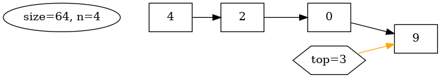
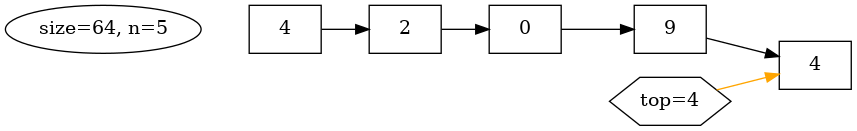
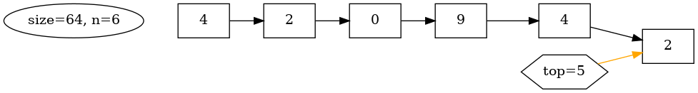
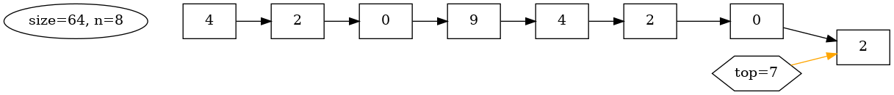
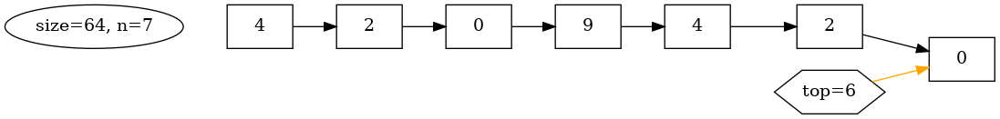
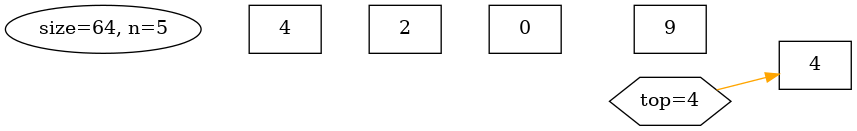
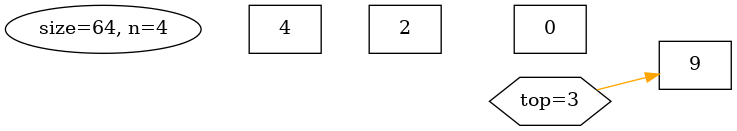
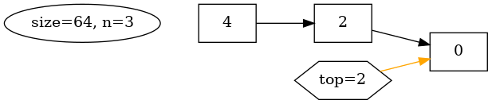
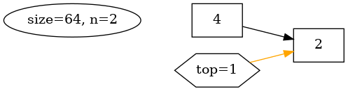
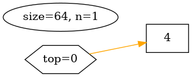

# Stack

``` sh
/*******************************************************************
                Tutorial 2    Stack

    1.  How to create a stack

    2.  struct in C (for describing the data structure of Stack)

    3.  StackPush() and StackPop()

    4.  How to print the string representations of an integer x 
        (based on a stack)

                                             COMP9024

 *******************************************************************/
``` 

A stack is an abstract data type primarily characterized by two fundamental operations:

Push

    add an element to the stack

Pop

    remove the most recently added element from the stack


The order in which an element added to or removed from a stack is described as First In Last Out (FILO)
or Last In First Out (LIFO).


In this tutorial, we will delve into the creation of a stack and its practical application in generating string representations of integers.

A stack can be implemented using an array (as demonstrated in this tutorial) or with a linked list ([COMP9024/Stacks/Stack_LL](../../Stacks/Stack_LL/README.md)) for storing stack items / elements.


### Sidetracks

Note that a call stack is a stack data structure that stores information about the active functions of a running program, 

which is supported by the operating system and CPU (or by an [interpreter](https://github.com/rocky/x-python/)).

The call stack also operates on a LIFO principle. 

**This implies that the function most recently invoked will be the first one to be removed from the call stack.**


## 1 How to download Tutorials in [CSE VLAB](https://vlabgateway.cse.unsw.edu.au/)

Open a terminal (Applications -> Terminal Emulator)

```sh

$ git clone https://github.com/sheisc/COMP9024.git

$ cd COMP9024/Tutorials/Week3

Week3$ 

```


## 2 How to start [Visual Studio Code](https://code.visualstudio.com/) to browse/edit/debug a project.


```sh

Week3$ code

```

Two configuration files (Week3/.vscode/[launch.json](https://code.visualstudio.com/docs/cpp/launch-json-reference) and Week3/.vscode/[tasks.json](https://code.visualstudio.com/docs/editor/tasks)) have been preset.


### 2.1 Open the project in VS Code

In the window of Visual Studio Code, please click "File" and "Open Folder",

select the folder "COMP9024/Tutorials/Week3", then click the "Open" button.


### 2.2 Build the project in VS Code

click **Terminal -> Run Build Task**


### 2.3 Debug the project in VS Code

Open src/Int2Str.c, and click to add a breakpoint (say, line 71).

Then, click **Run -> Start Debugging**


### 2.4 Directory

```sh
├── Makefile             defining set of tasks to be executed (the input file of the 'make' command)
|
├── README.md            introduction to this tutorial
|
├── src                  containing *.c and *.h
|    |
|    ├── Int2Str.c       print an integer as a string (based on a stack)
|    ├── Int2Str.h
|    ├── main.c          main()
|    ├── Stack.c         the implementation of an array-based stack
|    └── Stack.h         the header file of the stack
|
|
└── .vscode              containing configuration files for Visual Studio Code
    |
    ├── launch.json      specifying which program to debug and with which debugger,
    |                    used when you click "Run -> Start Debugging"
    |
    └── tasks.json       specifying which task to run (e.g., 'make' or 'make clean')
                         used when you click "Terminal -> Run Build Task" or "Terminal -> Run Task"
```
Makefile is discussed in [COMP9024/C/HowToMake](../../C/HowToMake/README.md).

## 3 Data structure and memory layout

```C

 Stack:

                -----------------------                                    --------------
                FieldName  FieldOffset                                     pItems[size-1]
                -----------------------                                       ...
  pStack -----> size         0                                             pItems[2]
                top          8                                             pItems[1]
                pItems      16           ----------------------------->    pItems[0]
                -----------------------                                    ---------------  
                    struct Stack                                        an array for storing items
                                                                                                          
 
 
 In C:    

      typedef long STACK_ITEM_T;

      struct Stack {
          // the current capacity size of a stack, in the number of items, not in bytes
          long size;
          // the stack top position
          long top;
          // pItems points to an array dynamically allocated in heap
          STACK_ITEM_T *pItems;
      };

```


## 4 The push/pop operations in printing the string representations of an integer (e.g., x)

```C
    long x = 20249024;
    long base = 10;
    do {
        r = x % base;
        x = x / base;
        printf("push %d\n", r);
        StackPush(pStack, r);
    } while (x != 0);
```
**Click on the window of 'feh' or use your mouse scroll wheel to view images**.

```sh
Week3$ make view
```

Here, **feh** is an image viewer available in [CSE VLAB](https://vlabgateway.cse.unsw.edu.au/).

|x| base | Remainder (r) | Quotient (x) |
|:-------------:|:-------------:|:-------------:|:-------------:| 
|2024| 10 | r = x % base | x = x / base|

|x|r | Action |State (initial) |
|:-------------:|:-------------:|:-------------:|:-------------:|
|20249024| |  | |

|x|r | Action |State (after pushing)|
|:-------------:|:-------------:|:-------------:|:-------------:|
|2024902| 4| Push(4) | |

|x|r | Action |State (after pushing) |
|:-------------:|:-------------:|:-------------:|:-------------:|
|202490| 2| Push(2) | |

|x|r | Action |State (after pushing) |
|:-------------:|:-------------:|:-------------:|:-------------:|
|20249| 0| Push(0) | |

|x|r | Action |State (after pushing) |
|:-------------:|:-------------:|:-------------:|:-------------:|
|2024| 9| Push(9) | |

|x|r | Action |State (after pushing) |
|:-------------:|:-------------:|:-------------:|:-------------:|
|202| 4| Push(4) | |

|x|r | Action |State (after pushing) |
|:-------------:|:-------------:|:-------------:|:-------------:|
|20| 2| Push(2) | |

|x|r | Action |State (after pushing) |
|:-------------:|:-------------:|:-------------:|:-------------:|
|2| 0| Push(0) | |

|x|r | Action |State (after pushing) |
|:-------------:|:-------------:|:-------------:|:-------------:|
|0| 2| Push(2) | |

| Stack | 
|:-------------:|
|  |

| Output | Action |  State (after popping) |
|:-------------:|:-------------:|:-------------:|
| 2| Pop() |  |

| Output | Action |  State (after popping) |
|:-------------:|:-------------:|:-------------:|
| 20| Pop() |  |

| Output | Action |  State (after popping) |
|:-------------:|:-------------:|:-------------:|
| 202| Pop() |  |

| Output | Action |  State (after popping) |
|:-------------:|:-------------:|:-------------:|
| 2024| Pop() |  |

| Output | Action |  State (after popping) |
|:-------------:|:-------------:|:-------------:|
| 20249| Pop() |  |

| Output | Action |  State (after popping) |
|:-------------:|:-------------:|:-------------:|
| 202490| Pop() |  |

| Output | Action |  State (after popping) |
|:-------------:|:-------------:|:-------------:|
| 2024902| Pop() |  |

| Output | Action |  State (after popping) |
|:-------------:|:-------------:|:-------------:|
| 20249024| Pop() |  |


**In addition to utilizing VS Code, we can also compile and execute programs directly from the command line interface as follows.**

``` sh
Week3$ make

Week3$ ./main
------------- x = 20249024, base = 10 -------------

push 4
push 2
push 0
push 9
push 4
push 2
push 0
push 2


After popping (First In Last Out):

20249024
------------- x = 20249024, base = 16 -------------

push 0
push 12
push 9
push 15
push 4
push 3
push 1


After popping (First In Last Out):

0x134F9C0
------------- x = 20249024, base = 8 -------------

push 0
push 0
push 7
push 4
push 7
push 1
push 5
push 1
push 1


After popping (First In Last Out):

0o115174700
------------- x = 20249024, base = 2 -------------

push 0
push 0
push 0
push 0
push 0
push 0
push 1
push 1
push 1
push 0
push 0
push 1
push 1
push 1
push 1
push 1
push 0
push 0
push 1
push 0
push 1
push 1
push 0
push 0
push 1


After popping (First In Last Out):

0b1001101001111100111000000

```

### Algorithm

```C
typedef long STACK_ITEM_T;

void PrintInteger(STACK_ITEM_T x, int base) {
    struct Stack *pStack = CreateStack();
    int r;

    x = (x >= 0 ? x : -x);
    base = (base >= 0 ? base: -base);

    printf("------------- x = %ld, base = %d -------------\n\n", (long) x, base);
    
    // push the remainders onto the stack
    do {
        r = x % base;
        x = x / base;
        printf("push %d\n", r);
        StackPush(pStack, r);
    } while (x != 0);

    printf("\n\nAfter popping (First In Last Out):\n\n");
    PrintPrefix(base);
    // output the remainders in the FILO order
    while(!StackIsEmpty(pStack)) {
        r = StackPop(pStack);
        // see https://www.asciitable.com/
        if (r <= 9) {
            // 1 --> '1' (0x31, 49); ...
            // 1 + 48 == 49
            printf("%c", r + 48);
        } else if (r <= 15) {
            // 10 --> 'A' (0x41, 65);  11 --> 'B', ...
            // 10 + 55 == 65
            printf("%c", r + 55);
        } else {
            // unknown base
            printf("?");
        }
    }
    ReleaseStack(pStack);
    printf("\n");
}

```


## 5 Practical exercise

**Our tutors will NOT answer the following questions in tutorials.**

### How to increase the size of a stack (based on an array) dynamically?
```sh
Double the capacity of the stack when it is full.
```


**Please complete the code (Q1-Q5) in StackPush() in src/Stack.c and then answer the questions in Quiz 2 (Week 3) on [Moodle](https://moodle.telt.unsw.edu.au/my/courses.php).**

