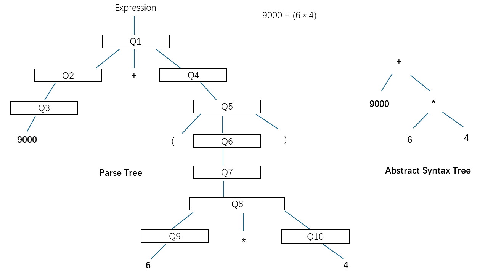

# Binary Tree

``` sh
/*******************************************************************
                Tutorial 3    Binary Tree

    1.  How to define the data structure of a binary tree in C

    2.  How to use a binary tree to represent an arithmetic expression

    3.  How to perform a postorder traversal of a binary tree

    4.  How to write a simple parser to parse an expression

    5.  How to evaluate an arithmetic expression 

                                             COMP9024 24T2

 *******************************************************************/
``` 

### Binary Tree
A binary tree is a hierarchical data structure wherein each node can have a maximum of two children, 

known as the left child and the right child.

### Postorder Traversal

Postorder traversal is a tree traversal method that adheres to the Left-Right-Root policy. 

In this method, each node in the tree is visited in the following sequence:

(1) The left subtree is traversed first.

(2) Then the right subtree is traversed.

(3) Finally, the root node of the subtree is traversed.

In [COMP9024/Trees/BiTree](../../Trees/BiTree/README.md), we have studied how to create a binary tree manually.

In this tutorial, we will delve into the creation of a binary tree (with a parser)

and its practical application in representing and evaluating an arithmetic expression (e.g., "9000 + (6 * 4)").


## 1 How to download Tutorials in [CSE VLAB](https://vlabgateway.cse.unsw.edu.au/)

Open a terminal (Applications -> Terminal Emulator)

```sh

$ git clone https://github.com/sheisc/COMP9024.git

$ cd COMP9024/Tutorials/Week4

Week4$ 

```


## 2 How to start [Visual Studio Code](https://code.visualstudio.com/) to browse/edit/debug a project.


```sh

Week4$ code

```

Two configuration files (Week4/.vscode/[launch.json](https://code.visualstudio.com/docs/cpp/launch-json-reference) and Week4/.vscode/[tasks.json](https://code.visualstudio.com/docs/editor/tasks)) have been preset.


### 2.1 Open the project in VS Code

In the window of Visual Studio Code, please click "File" and "Open Folder",

select the folder "COMP9024/Tutorials/Week4", then click the "Open" button.


### 2.2 Build the project in VS Code

click **Terminal -> Run Build Task**


### 2.3 Debug the project in VS Code

Open src/main.c, and click to add a breakpoint (say, line 67).

Then, click **Run -> Start Debugging**


### 2.4 Directory

```sh
├── Makefile             defining set of tasks to be executed (the input file of the 'make' command)
|
├── README.md            introduction to this tutorial
|
├── src                  containing *.c and *.h
|    |
|    ├── error.c         reporting an error
|    ├── error.h
|    ├── expr.c          create a tree by parsing an arithmetic expression (e.g., "9000 + (6 * 4)") and evaluate its value     
|    ├── expr.h
|    ├── lex.c           lexical analysis for recognizing a token (i.e., a word), such as 9000, +, (, ...
|    ├── lex.h      
|    ├── main.c          main()
|    └── tokens.txt      containing the token kinds and names
|
└── .vscode              containing configuration files for Visual Studio Code
    |
    ├── launch.json      specifying which program to debug and with which debugger,
    |                    used when you click "Run -> Start Debugging"
    |
    └── tasks.json       specifying which task to run (e.g., 'make' or 'make clean')
                         used when you click "Terminal -> Run Build Task" or "Terminal -> Run Task"
```
Makefile is discussed in [COMP9024/C/HowToMake](../../C/HowToMake/README.md).


## 3 Data structure 

### Introduction
```C
    
An expression (i.e., a string) from a user:

   "9000 + (6 * 4)" 

It is represented as a binary tree after parsing.

        + 
      /   \ 
    9000   * 
          /  \ 
         6    4 

Then, we can evaluate its value with a postorder traversal of the binary tree.

   eval("9000 + (6 * 4)") == 9024


Its intermediate representation (IR): 

	 t1 = 6 * 4
	 t0 = 9000 + t1


```

### Type definitions
```C

/*
  The Abstract Syntax Tree Node for an expression.

  In an abstract syntax tree, syntactic details such as parentheses in expressions 
  like "(20 + 30) * 40" are considered redundant and thus ignored.

           * 
         /   \
        +     40
      /   \ 
     20   30
 */
struct astExprNode {
  /*
    1. The kind of an expression node: 
         an operand (e.g., 300) or an operator (e.g., '+', '-', '*' and '/')
    
    2. To keep it simple, we use the TokenKind defined in tokens.txt.  
         TK_NUM for 300, 400, ...
         TK_ADD for '+'
         TK_SUB for '-'
         TK_MUL for '*'
         TK_DIV for '/'
   */
  TokenKind op;
  /*
   The value of the token (a token is a word), consisting of two parts:

   1. an integer for representing the node's value (e.g., 300), 
    
   2. a C string for representing its name or value (e.g., "+", "t0", "t1", "(", ")", "300", ...)
   */
  Value value;

  /////////////////////////////////////////////
  // e.g.,  left and right operands of a binary operator (+, -, *, /)
  struct astExprNode *kids[2];  
};

typedef struct astExprNode *AstExprNodePtr;

// token value
typedef struct {
  // e.g, "year", "t0", "t1", "+", "-", "*", "/", "(", ")", ...
  char name[MAX_ID_LEN + 1];
  // value of an integer, e.g., 2024
  long numVal;
} Value;

// In C, an Enum/Enumeration is a custom data type where users can assign names to constant integers. 
// Using enums makes it easier for programmers to learn, understand, and maintain the program.
typedef enum {
  TK_NA,    // 0     By default, the first item has the value 0. Here, NA stands for Not Available.
  TK_ADD,   // 1
  TK_SUB,   // 2
  TK_MUL,
  TK_DIV,
  TK_NUM, 
  TK_LPAREN,
  TK_RPAREN, 
  TK_EOF, 
} TokenKind;

```
## 4 Algorithm

## 4.1  Overview

``` C
static const char *srcCode = "9000 + (6 * 4)";

int main(int argc, char **argv, char **env) {
  // The source code to be parsed
  printf("\"%s\" \n\n", srcCode);

  // Initialize the lexical analysis
  InitLexer(NextCharFromMem);
  // Get the first token
  NEXT_TOKEN;

  // Create a tree by parsing the arithmetic expression
  AstExprNodePtr expr = Expression();
  Expect(TK_EOF);

  // Perform a postorder traversal of the tree
  long result = EvalExpression(expr);  

  // Output the result
  printf("\neval(\"%s\") == %ld\n", srcCode, result);
  
  // Free the heap memory
  ReleaseAstExpr(expr);
  return 0;
}
```


## 4.2 Postorder traversal

```C
// In fact, it is a simple interpreter
long EvalExpression(AstExprNodePtr root) {    
    assert(root);
    if (root->op == TK_NUM) { // 9000, 6, 4        
        return root->value.numVal;
    }
    else if (isArithmeticOperator(root->op)) { // +, -, *, /
        //
        assert(root->kids[0]);
        assert(root->kids[1]);        
        long leftOperand = EvalExpression(root->kids[0]);
        long rightOperand = EvalExpression(root->kids[1]); 
        // Postorder traversal
        long result = 0;
        switch (root->op) {
            case TK_ADD:                
                result = leftOperand + rightOperand;
                EmitIR("%s = %s + %s\n", root->value.name, 
                                         root->kids[0]->value.name, 
                                         root->kids[1]->value.name);
                break;
            case TK_SUB:
                result = leftOperand - rightOperand;
                EmitIR("%s = %s - %s\n", root->value.name, 
                                         root->kids[0]->value.name, 
                                         root->kids[1]->value.name);              
                break;
            case TK_MUL:
                result = leftOperand * rightOperand;
                EmitIR("%s = %s * %s\n", root->value.name, 
                                         root->kids[0]->value.name, 
                                         root->kids[1]->value.name);             
                break;
            case TK_DIV:
                result = leftOperand / rightOperand;
                EmitIR("%s = %s / %s\n", root->value.name, 
                                         root->kids[0]->value.name, 
                                         root->kids[1]->value.name);               
                break;
            default:
                break;              
        }
        return result;
    } else {
      Error("Unknown operator/operand");
    }
}

```

## 5 The grammar of an arithmetic expression 

The grammar of an arithmetic expression is recursive.

So our parser will be implemented in recursive functions.

### A snapshot of the Call Stack in VS code when debugging this program
```sh
MultiplicativeExpression() (Tutorials/Week4/src/expr.c:85)
AdditiveExpression() (Tutorials/Week4/src/expr.c:122)
Expression() (Tutorials/Week4/src/expr.c:188)
PrimaryExpression() (Tutorials/Week4/src/expr.c:59)
MultiplicativeExpression() (Tutorials/Week4/src/expr.c:81)
AdditiveExpression() (Tutorials/Week4/src/expr.c:156)
Expression() (Tutorials/Week4/src/expr.c:188)
main(int argc, char ** argv, char ** env) (Tutorials/Week4/src/main.c:73)
```

### 5.1 PrimaryExpression 

It is used to describe numbers (like 9000, 6, and 4) or a sub-expression in a pair of parentheses (like (6*4)).

```C
  PrimaryExpression:
      NUM
      (Expression)
```

### 5.2 MultiplicativeExpression 

It is used to describe a multiplicative expression like 6 * 4 or a primary expression (like (6*4) or 6)

```C  
  MultiplicativeExpression:
          PrimaryExpression
          PrimaryExpression  mop PrimaryExpression  ...   mop PrimaryExpression  

  // multiplicative operator
  mop:
              *  
              / 
```

### 5.3  AdditiveExpression 

It is used to describe an additive expression like 9000 + 6 * 4 or a multiplicative expression like 6*4.

```C  
  AdditiveExpression:
        MultiplicativeExpression
        MultiplicativeExpression  aop MultiplicativeExpression  ...   aop MultiplicativeExpression  

  // additive operator
  aop:
              +  
              -
```

### 5.4  Arithmetic expression
```C 
  Expression:
        AdditiveExpression
```

## 6 How to write a parser based on the grammar of an arithmetic expression


Take "9000  +  ( 6  *  4 )" as an example.


```C
static AstExprNodePtr AdditiveExpression(void) {
  AstExprNodePtr left;
  /*  
      Now, the curToken points to 9000 (i.e, TK_NUM)

      9000  +  ( 6  *  4 )
      ^
      ^
      Current Token

      Let's call MultiplicativeExpression() to parse the first MultiplicativeExpression in an AdditiveExpression.
      MultiplicativeExpression() will return a sub-tree for "9000"      
   */
  left = MultiplicativeExpression();
  /*
    Now, the curToken points to '+' (i.e, TK_ADD)

    9000  +  ( 6  *  4 )
          ^
          ^
          Current Token

    Parse "aop MultiplicativeExpression" if they are in the input stream
   */
  while (curToken.kind == TK_SUB || curToken.kind == TK_ADD) {
    Value value;
    AstExprNodePtr expr;
    memset(&value, 0, sizeof(value));
    // A temporary variable "t0" is assigned the value resulting from the expression "t0 = 9000 + t1".
    // "t1 = 6 * 4" will be created in MultiplicativeExpression() later.    
    snprintf(value.name, MAX_ID_LEN, TEMP_VAR_NAME_FMT, NewTemp());
    // create a tree node for '+' or '-'
    expr = CreateAstExprNode(curToken.kind, &value, NULL, NULL);
    // skip '+' or '-'
    NEXT_TOKEN;
    /*
      Now, the curToken points to '('

      9000  +  ( 6  *  4 )
               ^
               ^
               Current Token
            
      Call MultiplicativeExpression() to parse the right operand "(6 * 4)"
      Again, it will return a sub-tree for "(6 * 4)"
    */    
    expr->kids[0] = left;
    expr->kids[1] = MultiplicativeExpression();
    /*
      If the current token is '+' or '-', The while-loop will iterate once more.
      Otherwise, the while-loop will stop, meaning our parser has recognized an additive expression
      in the input stream.

      In this simple example, now, the current token is TK_EOF (end of file).

      9000  +  ( 6  *  4 ) 
                            ^
                            ^
                            Current Token
      
     */
    left = expr;
  }
  return left;
}
```

The function MultiplicativeExpression() in expr.c can be analyzed similarly.


## 7  Lexical analysis

The lexical analysis is used to recognize tokens (i.e., words).

The code is in src/lex.c.

## 8 Practical exercise

**Our tutors will NOT answer the following questions in tutorials.**

**1. Debug this program in VS Code and follow the recursive functions in expr.c step by step during parsing "9000 + (6 * 4)".**


**2. Complete Q1-Q10 in the parse tree with function names you discovered during debugging and then answer the questions in Quiz 3 (Week 4) in [Moodle](https://moodle.telt.unsw.edu.au/my/courses.php).**




