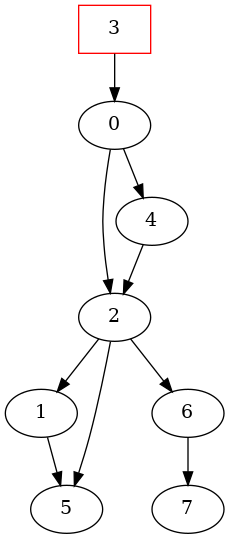
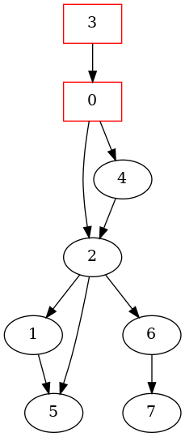
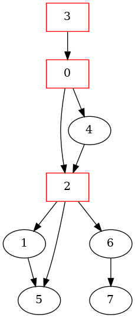
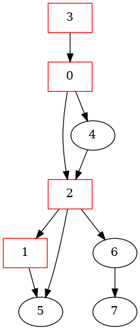
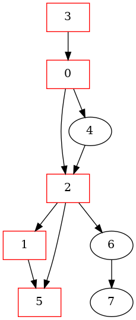
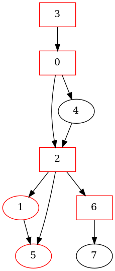
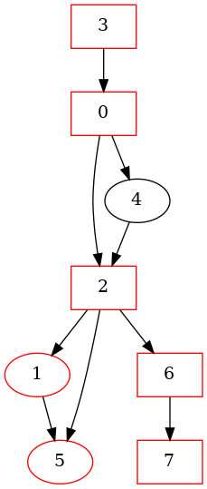
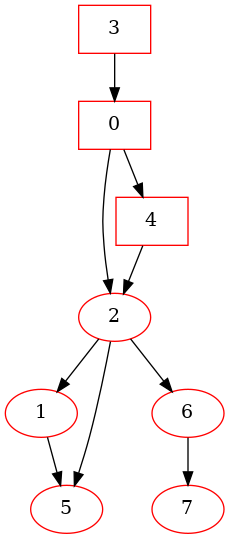

# Depth First Search

``` sh
/*******************************************************************
                Tutorial 4    Depth First Search

    1.  How to define the data structure of a directed graph in C

    2.  How to perform a recursive depth first search in a directed graph

    3.  How to perform a non-recursive depth first search in a directed graph


                                             COMP9024 24T2

 *******************************************************************/
``` 

### Depth First Search

Depth First Search (DFS) is an algorithm used to traverse a graph or tree data structure. 

It starts at a designated node, and explores as far as possible along each edge before backtracking. 

This means it goes as deep as possible along one edge before exploring other edges.


We have discussed how to create a directed graph in [COMP9024/Graphs/DirectedGraph](../../Graphs/DirectedGraph/README.md).

In this tutorial, we'll explore how to perform a recursive depth-first search within it.

Non-recursive depth first search (based on a [data stack](../../Stacks/Stack_LL/README.md)) is left as the weekly practical exercise.


## 1 How to download Tutorials in [CSE VLAB](https://vlabgateway.cse.unsw.edu.au/)

Open a terminal (Applications -> Terminal Emulator)

```sh

$ git clone https://github.com/sheisc/COMP9024.git

$ cd COMP9024/Tutorials/Week5

Week5$ 

```


## 2 How to start [Visual Studio Code](https://code.visualstudio.com/) to browse/edit/debug a project.


```sh

Week5$ code

```

Two configuration files (Week5/.vscode/[launch.json](https://code.visualstudio.com/docs/cpp/launch-json-reference) and Week5/.vscode/[tasks.json](https://code.visualstudio.com/docs/editor/tasks)) have been preset.


### 2.1 Open the project in VS Code

In the window of Visual Studio Code, please click "File" and "Open Folder",

select the folder "COMP9024/Tutorials/Week5", then click the "Open" button.


### 2.2 Build the project in VS Code

click **Terminal -> Run Build Task**


### 2.3 Debug the project in VS Code

Open src/main.c, and click to add a breakpoint (say, line 11).

Then, click **Run -> Start Debugging**


### 2.4 Directory

```sh
├── Makefile             defining set of tasks to be executed (the input file of the 'make' command)
|
├── README.md            introduction to this tutorial
|
├── images               *.dot and *.png files generated by this program
|
├── src                  containing *.c and *.h
|    |
|    ├── Graph.c         containing the code for Directed Graph
|    ├── Graph.h
|    ├── Stack.c         For non-recursive DFS   
|    ├── Stack.h
|    ├── main.c          main()
|
└── .vscode              containing configuration files for Visual Studio Code
    |
    ├── launch.json      specifying which program to debug and with which debugger,
    |                    used when you click "Run -> Start Debugging"
    |
    └── tasks.json       specifying which task to run (e.g., 'make' or 'make clean')
                         used when you click "Terminal -> Run Build Task" or "Terminal -> Run Task"
```
Makefile is discussed in [COMP9024/C/HowToMake](../../C/HowToMake/README.md).


## 3 The procedure of recursive depth first search

**In addition to utilizing VS Code, we can also compile and execute programs directly from the command line interface as follows.**

``` sh

Week5$ make

Week5$ ./main

**********  The Adjacency Matrix ************* 
0 0 1 0 1 0 0 0 
0 0 0 0 0 1 0 0 
0 1 0 0 0 1 1 0 
1 0 0 0 0 0 0 0 
0 0 1 0 0 0 0 0 
0 0 0 0 0 0 0 0 
0 0 0 0 0 0 0 1 
0 0 0 0 0 0 0 0 


RecursiveDFS() starting from node 3:

visiting 3
visiting 0
visiting 2
visiting 1
visiting 5
visiting 6
visiting 7
visiting 4

Week5$ make view

find . -name "*.png" | sort | xargs feh &

```

## Observe the procedure of DFS (starting from the node 3) via 'make view'

**Click on the window of 'feh' to view images**.

Here, **feh** is an image viewer available in [CSE VLAB](https://vlabgateway.cse.unsw.edu.au/).

**Ensure that you have executed 'make' and './main' before 'make view'.**


| Initial | 
|:-------------:|
|  |  


| Visiting 3 | Visiting 0 |  Visiting 2 | Visiting 1 |
|:-------------:|:-------------:|:-------------:|:-------------:|
|  |   |  |  | 


| Visiting 5 | Visiting 6 |  Visiting 7 | Visiting 4 |
|:-------------:|:-------------:|:-------------:|:-------------:|
|  |   |  |  | 


## 4 Data structure
```C
// Storing information of a graph node
struct GraphNode {
    char name[MAX_ID_LEN + 1]; 
} GraphNode;

typedef long AdjMatrixElementTy;

struct Graph{
    /*
       Memory Layout:
                          -----------------------------------------------------------
        pAdjMatrix ---->  Element(0, 0),   Element(0, 1),    ...,       Element(0, n-1),     // each row has n elements
                          Element(1, 0),   Element(1, 1),    ...,       Element(1, n-1),
      
                          .....                            Element(u, v)     ...             // (n * u + v) elements away from Element(0, 0)
      
                          Element(n-1, 0), Element(n-1, 1),  ...,       Element(n-1, n-1)
                          ----------------------------------------------------------- 
                                      Adjacent Matrix on Heap

     */
    AdjMatrixElementTy *pAdjMatrix;
    /*
       Memory Layout
                        ---------------------------
                        pNodes[n-1]
       
       
                        pNodes[1]
       pNodes ----->    pNodes[0]
                       ----------------------------
                        struct GraphNode[n] on Heap
     */
    struct GraphNode *pNodes;
    // number of nodes
    long n;
    // whether it is a directed graph
    int isDirected;
};

// 0 <= u < n,  0 <= v < n
// ELement(u, v) is (n * u + v) elements away from Element(0, 0)
#define  MatrixElement(pGraph, u, v)  (pGraph)->pAdjMatrix[(pGraph)->n * (u) + (v)]

```
## 5 Algorithm


``` C
#define CONNECTED   1

static void DepthFirstSearch(struct Graph *pGraph, long u, int *visited) {
    visited[u] = 1;
    printf("visiting %s\n", pGraph->pNodes[u].name);
    
    static long i = 0;
    i++;
    GenOneImage(pGraph, "dfs", "images/RecursiveDFS", i, visited);

    // recursively visit the adjacent nodes of u, if they have not been visited yet
    for(long v = 0; v < pGraph->n; v++) {
        if (MatrixElement(pGraph, u, v) == CONNECTED && !visited[v]) {
            DepthFirstSearch(pGraph, v, visited);
        }
    }
}

void RecursiveDFS(struct Graph *pGraph, long u) {
    int *visited = (int *) malloc(pGraph->n * sizeof(int));

    for (long v = 0; v < pGraph->n; v++) {
        visited[v] = 0;
    }
    GenOneImage(pGraph, "dfs", "images/RecursiveDFS", 0, visited);

    DepthFirstSearch(pGraph, u, visited);

    free(visited);
}
```


## 6 Practical exercise

**Our tutors will NOT answer the following questions in tutorials.**

**Please complete the following code in Q1-Q5 (NonRecursiveDFS() in [Graph.c](./src/Graph.c)) and then answer the questions in Quiz 4 (Week 5) on [Moodle](https://moodle.telt.unsw.edu.au/my/courses.php).**

```C

/*
    Please complete the code in Q1-Q5:

    Q1:  create a data stack
    Q2:  push u onto the data stack
    Q3:  test whether the data stack is empty
    Q4:  push v onto the data stack
    Q5:  free the heap space occupied by the data stack

  */
void NonRecursiveDFS(struct Graph *pGraph, long u) {
    assert(IsLegalNodeNum(pGraph, u));
    static long cnt = 0;

    int *visited = (int *) malloc(sizeof(int) * pGraph->n);
    struct Stack *pStack = ______Q1______;
    assert(visited && pStack);

    for (long i = 0; i < pGraph->n; i++) {
        visited[i] = 0;
    }
    GenOneImage(pGraph, "dfs", "images/NonRecursiveDFS", cnt, visited);
    printf("\n\t\t\t\tpush %ld\n", u);
    ______Q2______;

    while (______Q3______) {
        printf("\n");
        PrintStack(pStack);
        STACK_ITEM_T curNodeId = StackPop(pStack);
        printf("\t\t\t\tpop %ld\n", curNodeId);
        if (!visited[curNodeId]) {
            visited[curNodeId] = 1;
            printf("\t\t\t\t\t\tvisiting %s\n", pGraph->pNodes[curNodeId].name);
            
            cnt++;
            GenOneImage(pGraph, "dfs", "images/NonRecursiveDFS", cnt, visited);             

            //for (long v = 0; v < pGraph->n; v++) {
            for (long v = pGraph->n - 1; v >= 0; v--) {
                if (MatrixElement(pGraph, curNodeId, v) == CONNECTED && !visited[v]) {
                    ______Q4______;
                    printf("\t\t\t\tpush %ld\n", v);
                }
            }            
        }
    }
    printf("\n");
    ______Q5______;
    free(visited);    
}

```


## Once you have completed the code in Q1-Q5 correctly, you will see the following output.


``` sh

Week5$ make

Week5$ ./main

...

NonRecursiveDFS() starting from node 3:

				push 3

Stack: 3
				pop 3
						visiting 3
				push 0

Stack: 0
				pop 0
						visiting 0
				push 4
				push 2

Stack: 2 --> 4
				pop 2
						visiting 2
				push 6
				push 5
				push 1

Stack: 1 --> 5 --> 6 --> 4
				pop 1
						visiting 1
				push 5

Stack: 5 --> 5 --> 6 --> 4
				pop 5
						visiting 5

Stack: 5 --> 6 --> 4
				pop 5

Stack: 6 --> 4
				pop 6
						visiting 6
				push 7

Stack: 7 --> 4
				pop 7
						visiting 7

Stack: 4
				pop 4
						visiting 4


```


