# Binary Search Tree

``` sh
/*******************************************************************
                Tutorial 7    Binary Search Tree

    1.  How to do an in-order traversal in a binary search tree

    2.  How to insert data in a binary search tree

    3.  How to delete data in a binary search tree

    4.  How to search for a value in a binary search tree

                                             COMP9024 24T2

 *******************************************************************/
``` 
A Binary Search Tree (BST) is a type of data structure that organizes data efficiently. 

Each node has at most two children, with values smaller than the node on the left and values larger on the right. 

This arrangement allows for fast operations like searching, inserting, and deleting data, making BSTs ideal for tasks that require quick access to sorted information.


In this tutorial, we study how to insert and delete data in a BST.

Searching within a BST is left as the weekly practical exercise.

```sh
           50  
        /      \
      20        70
     /  \      /  \  
    10  30    60  100
          \        /
          40      90
                 /
                80
```


## 1 How to download COMP9024/Tutorials/Week9 in [CSE VLAB](https://vlabgateway.cse.unsw.edu.au/)

Open a terminal (Applications -> Terminal Emulator)

```sh

$ git clone https://github.com/sheisc/COMP9024.git

$ cd COMP9024/Tutorials/Week9

Week9$ 

```


## 2 How to start [Visual Studio Code](https://code.visualstudio.com/) to browse/edit/debug a project.


```sh

Week9$ code

```

Two configuration files (Week9/.vscode/[launch.json](https://code.visualstudio.com/docs/cpp/launch-json-reference) and Week9/.vscode/[tasks.json](https://code.visualstudio.com/docs/editor/tasks)) have been preset.


#### 2.1 Open the project in VS Code

In the window of Visual Studio Code, please click "File" and "Open Folder",

select the folder "COMP9024/Tutorials/Week9", then click the "Open" button.


#### 2.2 Build the project in VS Code

click **Terminal -> Run Build Task**


#### 2.3 Debug the project in VS Code

Open src/main.c, and click to add a breakpoint (say, line 45).

Then, click **Run -> Start Debugging**

### 2.4 Directory

```sh
├── Makefile             defining set of tasks to be executed (the input file of the 'make' command)
|
├── README.md            introduction to this tutorial
|
├── src                  containing *.c and *.h
|   |
|   |
│   ├── BiTree.c         Binary Search Tree
│   ├── BiTree.h
|   |
│   ├── Queue.c          used in a breadth-first tree traversal when generating *.dot files
│   ├── Queue.h
|   |
│   └── main.c           main()
|
|── images               containing *.dot and *.png files
|
└── .vscode              containing configuration files for Visual Studio Code
    |
    ├── launch.json      specifying which program to debug and with which debugger,
    |                    used when you click "Run -> Start Debugging"
    |
    └── tasks.json       specifying which task to run (e.g., 'make' or 'make clean')
                         used when you click "Terminal -> Run Build Task" or "Terminal -> Run Task"
```

Makefile is discussed in [COMP9024/C/HowToMake](../../C/HowToMake/README.md).

## 3 The main procedure

### 3.1 make and ./main

**In addition to utilizing VS Code, we can also compile and execute programs directly from the command line interface as follows.**

``` sh

Week7$ make

Week7$ ./main

*******************************  Testing BiTreeInsert() *******************************


After inserting 50 
*****************  InOrderTraversal() **********************
50 

...


*******************************  Testing BiTreeDelete() *******************************


deleting 50
After deleting 50 
*****************  InOrderTraversal() **********************
10 20 30 40 60 70 80 90 100 

...

```

### 3.2 make view

**Ensure that you have executed 'make' and './main' before 'make view'.**


```sh
Week7$ make view
```

**Click on the window of 'feh' or use your mouse scroll wheel to view images**.

Here, **feh** is an image viewer available in [CSE VLAB](https://vlabgateway.cse.unsw.edu.au/).


#### 3.2.1 BiTreeInsert()

| Insert 50 | Insert 20  |  Insert 10  |  Insert 30 |
|:-------------:|:-------------:|:-------------:|:-------------:|
| 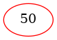 |  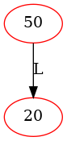 |  | 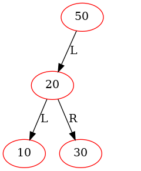 |


| Insert 40 | Insert 70  |  Insert 60  |
|:-------------:|:-------------:|:-------------:|
|  |   | 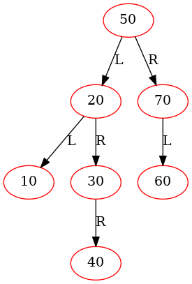 |

| Insert 100 | Insert 90  |  Insert 80  |
|:-------------:|:-------------:|:-------------:|
| 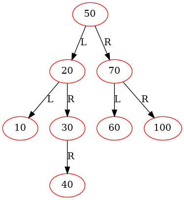 |   |  |


#### 3.2.2 BiTreeDelete()

| Node to Be Deleted | Left Child |  Right Child   |
|:-------------:|:-------------:|:-------------:|
| Case 00 | NULL |  NULL   |
| Case 01 | NULL |  NOT NULL   |
| Case 10 | NOT NULL |  NULL   |
| Case 11 | NOT NULL |  NOT NULL   |

| Initial | Delete 50 (case 11 in the previous state, swapping 50 and 60, inconsistency) |  Delete 50 (case 00 in the previous state)  |
|:-------------:|:-------------:|:-------------:|
| 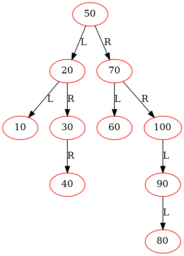 |  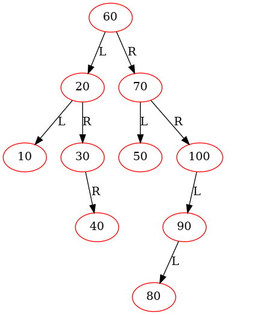 | 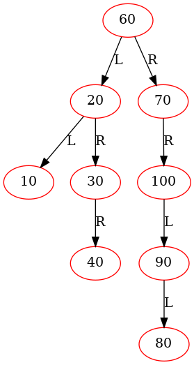 |


|Delete 20 (case 11 in the previous state, swapping 20 and 30, inconsistency) | Delete 20 (case 01 in the previous state)  |  Delete 10 (case 00 in the previous state)  |
|:-------------:|:-------------:|:-------------:|
|  |  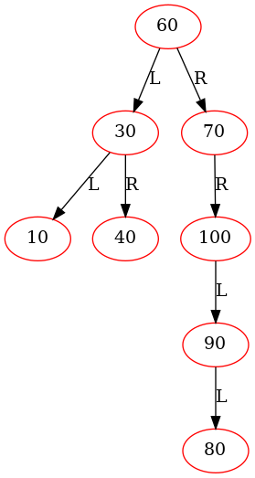 | 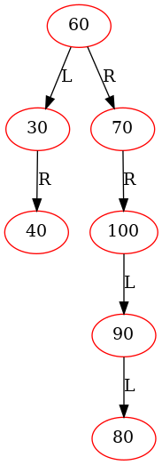 |


| Delete 30 (case 01 in the previous state) | Delete 40 (case 00 in the previous state)  |  Delete 70 (case 01 in the previous state) | Delete 60 (case 01 in the previous state) |
|:-------------:|:-------------:|:-------------:|:-------------:|
| 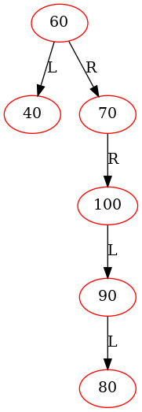 |   | 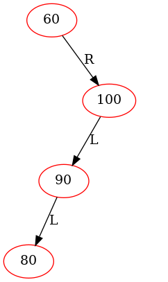 | 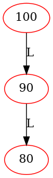 |


| Delete 100 (case 10 in the previous state) | Delete 90 (case 10 in the previous state) |  Delete 80 (case 00 in the previous state) | 
|:-------------:|:-------------:|:-------------:|
|  |  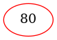 |  | 


## 4 Data structures

```C

struct BiTreeNode {
    /*
     The value of a binary tree node:
  
     1. an integer for representing the node's value (e.g., 300), 
      
     2. a C string for representing its node name
     */
    NodeValue value;  
    // left subtree
    struct BiTreeNode *leftChild;
    // right subtree
    struct BiTreeNode *rightChild;

    // ...
};

typedef struct BiTreeNode *BiTreeNodePtr;
```


## 5 Algorithms

### 5.1 main()
```sh

    // long nums[] = {50, 20, 10, 30, 40, 70, 60, 100, 90, 80};
    // 'nums[]' contains the pre-order traversal of the following binary search tree.

           50  
        /      \
      20        70
     /  \      /  \  
    10  30    60  100
          \        /
          40      90
                 /
                80
 
```

```C
int main(int argc, char **argv, char **env) {
    // ...
    // Create an empty binary tree
    BiTreeNodePtr root = NULL;
     
    printf("*******************************  Testing BiTreeInsert() *******************************\n\n\n");
    long nums[] = {50, 20, 10, 30, 40, 70, 60, 100, 90, 80};
    for (int i = 0; i < sizeof(nums)/sizeof(nums[0]); i++) {
        BiTreeInsert(&root, nums[i], NULL);
        // ...     
    }

    printf("\n\n\n*******************************  Testing BiTreeDelete() *******************************\n\n\n");
    for (int i = 0; i < sizeof(nums)/sizeof(nums[0]); i++) {                        
        BiTreeDelete(&root, &root, nums[i]);
        // ...
    }
    // Free the heap memory
    ReleaseBinaryTree(root);
    return 0;
}
```

### 5.2 BiTreeInsert()

```C

void BiTreeInsert(BiTreeNodePtr *pNodePtr, long numVal, char *nodeName) {  
    BiTreeNodePtr pNode = *pNodePtr;
    if (pNode == NULL) {
        BiTreeNodePtr tmp = CreateBinaryTreeNode(numVal, nodeName, NULL, NULL);
        *pNodePtr = tmp;
    } else {
        if (numVal < pNode->value.numVal) {
            BiTreeInsert(&pNode->leftChild, numVal, nodeName);
        } else if (numVal > pNode->value.numVal) {
            BiTreeInsert(&pNode->rightChild, numVal, nodeName);
        } else {
            // If numVal is already in the binary search tree, do nothing.
        }
    }  
}
```

### 5.3 BiTreeDelete()

```C

BiTreeNodePtr BiTreeMinValueNode(BiTreeNodePtr root) {
    BiTreeNodePtr cur = root;
    // Get the left-most node
    while ((cur != NULL) && (cur->leftChild != NULL)) {
        cur = cur->leftChild;
    }
    return cur;
}

void BiTreeDelete(BiTreeNodePtr *pRoot, BiTreeNodePtr *pNodePtr, long numVal) {
    static long cnt = 0;

    BiTreeNodePtr pNode = *pNodePtr;
    if (pNode) {
        if (numVal < pNode->value.numVal) {
            BiTreeDelete(pRoot, &(pNode->leftChild), numVal);
        } else if (numVal > pNode->value.numVal) {
            BiTreeDelete(pRoot, &(pNode->rightChild), numVal);
        } else {
            /************************************************************************
                If the node (to be deleted) has:

                    0 child:

                        leftChild == NULL && rightChild == NULL    // case 00

                    1 child:

                        leftChild == NULL && rightChild != NULL    // case 01

                        or 
                        leftChild != NULL && rightChild == NULL    // case 10
                 
                    2 children:

                        leftChild != NULL && rightChild != NULL    // case 11

             **************************************************************************/
            
            if (pNode->leftChild == NULL) {   // case 00 and case 01
                BiTreeNodePtr tmp = pNode->rightChild;
                printf("deleting %ld\n", pNode->value.numVal);
                free(pNode);
                *pNodePtr = tmp;

                cnt++;
                GenOneImage(*pRoot, "BiTreeDelete", "images/BiTreeDelete", cnt);
            } else if (pNode->rightChild == NULL) { // case 10
                BiTreeNodePtr tmp = pNode->leftChild;
                printf("deleting %ld\n", pNode->value.numVal);      
                free(pNode);
                *pNodePtr = tmp;

                cnt++;
                GenOneImage(*pRoot, "BiTreeDelete", "images/BiTreeDelete", cnt);                
            } else {
                // case 11:  with two children
                // Get pNode's in-order successor, which is left-most node in its right sub-tree.
                BiTreeNodePtr pSuccessor = BiTreeMinValueNode(pNode->rightChild);

                // (Swapping is done for clearer debugging output)
                // Swap the values of the node pointed to by pNode and its in-order successor              
                NodeValue val = pNode->value;
                // Copy the successor's value (this copy is necessary)
                pNode->value = pSuccessor->value;
                pSuccessor->value = val;

                // Display the inconsistent state
                cnt++;
                GenOneImage(*pRoot, "BiTreeDelete", "images/BiTreeDelete", cnt);
                // Now, numVal is in right sub-tree. Let us recursively delete it.
                // Temporarily, the whole binary search tree is at an inconsistent state.
                // It will become consistent when the deletion is really done.
                BiTreeDelete(pRoot, &pNode->rightChild, pSuccessor->value.numVal);
            }
        }
    }
}
```

## 6 Practical exercise

**Our tutors will NOT answer the following questions in tutorials.**

**Please complete the code in Q1-Q5 (BiTreeSearch() in [BiTree.c](./src/BiTree.c)) and then answer the questions in Quiz 7 (Week 9) on [Moodle](https://moodle.telt.unsw.edu.au/my/courses.php).**

```C
BiTreeNodePtr BiTreeSearch(BiTreeNodePtr root, long numVal) {
    if (______Q1______) {
        return ______Q2______;
    } else if (numVal == root->value.numVal) {
        return ______Q3______;
    } else if (numVal < root->value.numVal) {
        return ______Q4______;
    } else { // numVal > root->value.numVal
        return ______Q5______;
    }
}
```


## Once you have completed the code in Q1-Q5 correctly, you will see the following output.


``` sh

...

*******************************  Testing BiTreeSearch() *******************************


Found: BiTreeSearch(root, 80) == 80

...


```