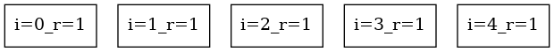
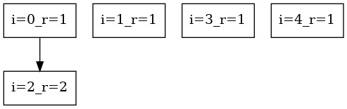
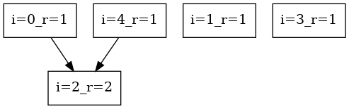
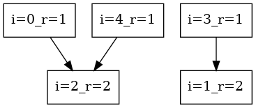
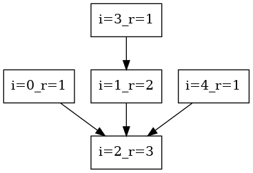
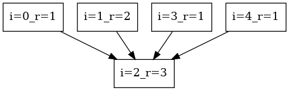

# Disjoint Sets

``` sh
/*******************************************************************
                    Disjoint Sets 

    1.  DisjointSetsUnion()

    2.  DisjointSetsFind()

                                             COMP9024

 *******************************************************************/
``` 

## Introduction

###  make view

**Ensure that you have executed 'make' and './main' before 'make view'.**


```sh
UnionFind$ make view
find ./images -name "*.png" | sort | xargs feh -g 1024x768 &
```

**Click on the window of 'feh' or use your mouse scroll wheel to view images**.

Here, **feh** is an image viewer available in [CSE VLAB](https://vlabgateway.cse.unsw.edu.au/).


| Initial | 
|:-------------:|
|  |  

| Union(0, 2) | 
|:-------------:|
|  | 


| Union(4, 2) | 
|:-------------:|
|  | 


| Union(3, 1) | 
|:-------------:|
|  | 

| Union(3, 4) | 
|:-------------:|
|  | 

| Find(3) with path compression | 
|:-------------:|
|  | 

### Data Structures

```C
struct DisjointSets {
    /*
        If parents[i] == i, 
            node i is the representative of ta disjoint set.
        
        It points to an array; node parents[i] is the parent of node i
     */
    DJSET_INT_T *parents;
    /*
        When parents[i] == i,
            ranks[i] is approximately the height of the tree (representing a disjoint set).
        Due to path compression in find(), the height is not precise enough.
        That is why it is named as rank, rather than height.
     */
    DJSET_INT_T *ranks;
    // total number of nodes
    DJSET_INT_T n;
};
```
